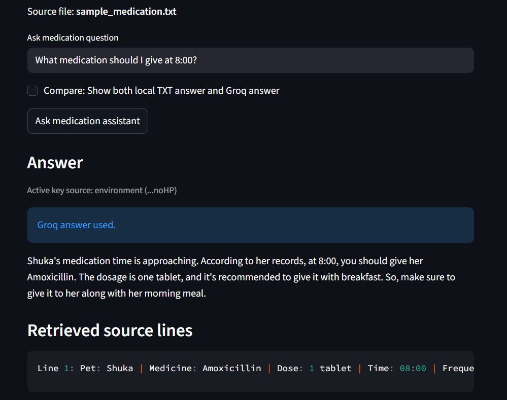
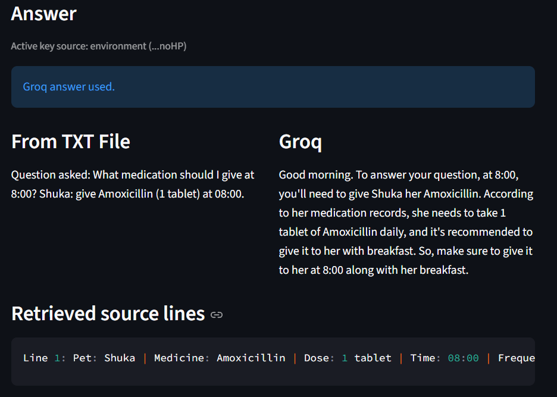
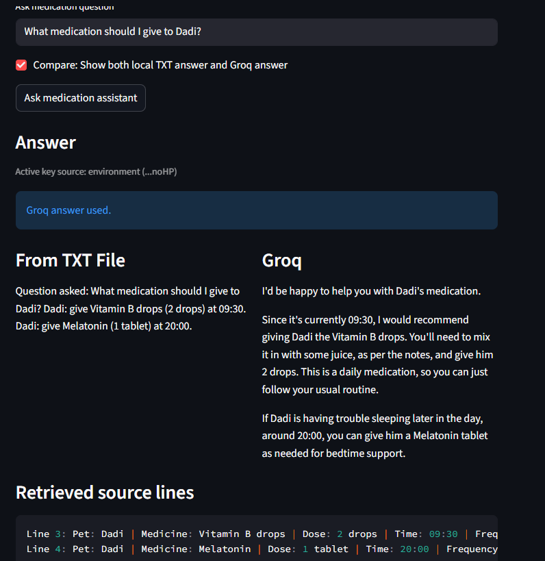
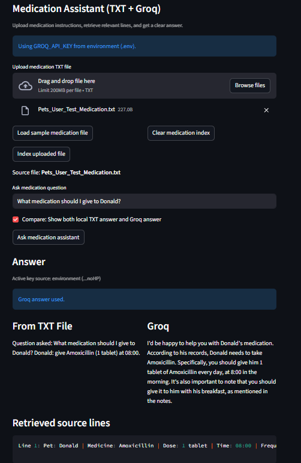
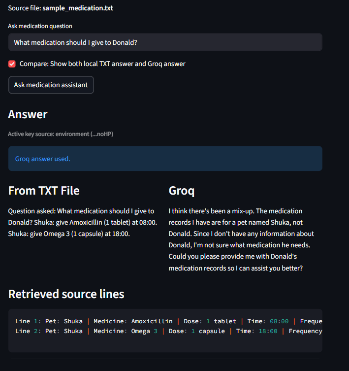

# Title and Summary: PawPal+

PawPal+ is a Streamlit-based pet care planning app for managing multiple pets, scheduling tasks, and tracking daily care activities.

The app also includes a medication assistant that implements the Retrieval-Augmented Generation (RAG) feature. It reads medication instructions from a TXT file, retrieves relevant lines using stop-word filtering, and uses Groq to explain what medicine to give and at what time.

# Architecture Overview: A short explanation of your system diagram.
## Updated System Design
app.py -> medication_rag.py -> assets/sample_medication.txt
medication_rag.py -> Groq API via GROQ_API_KEY
tests/test_medication_rag.py -> medication_rag.py
README.md -> guides setup for app.py and medication_rag.p

# Setup Instructions: Step-by-step directions to run your code.
### Setup

```bash
python -m venv .venv
source .venv/bin/activate  # Windows: .venv\Scripts\activate
pip install -r requirements.txt
```

### API Key Setup (Groq)

1. Create your key at: https://console.groq.com/keys
2. Put your key in `.env`:

```bash
GROQ_API_KEY=your_groq_key_here
```

Run a quick check:

```bash
python main.py
```

If the key is missing, the program prints a warning that LLM features are disabled.

### Run the App

```bash
streamlit run app.py
```

In the app, go to the **Medication Assistant (TXT + Groq)** section:

1. Load the sample file or upload your own medication TXT.
2. Ask a medication question.
3. Review the answer and the retrieved source lines.

### Testing

Run tests with:

```bash
python -m pytest
```

# Sample Interactions: Include at least 2-3 examples of inputs and the resulting AI outputs to demonstrate the system is functional.
_Ex1: Question: What medication should I give at 8:00? (Use sample medication file)_
- 
- 

_Ex2: Question: What medication should I give to Dadi?_
- 

_Ex3: User uploads a txt file_
- 

_Ex4: Unknown pet case_
- 

# Design Decisions: Why you built it this way, and what trade-offs you made.
Some pet owners have trouble understanding and remembering their pet's medication details, so this program can assist them in that process. 
Example scenario of 1 problem that occurred during the process.
    Problem detected: What was wrong:
    - Retrieval scored all records by keyword overlap.
    - For question like “What medicine should Shuka get?”, every line had common words like “medicine”, so other pets still appeared.
    Fix:
    - Added pet-aware filtering: if a pet name is in the question, retrieval now only considers that pet’s records.
    - Added time-aware filtering: if question contains time (08:00, 8am, 8 pm), retrieval now narrows records to matching time.
    - Kept scoring after filtering, so ranking still works on relevant subset.

One tradeoff is that the developer might need to update the API key in .env file occassionally to overcome the quota limit. 

# Testing Summary: What worked, what didn't, and what you learned.
- At first, I tried using Gemini's API key feature, but there was a quota limit and it was not working. So, I researched online and found GroqCloud to be a better option. This LLM was used to explain the contents of the txt files to the user in a friendly manner. I also added a feature where the user can upload the medication txt file. 

# Reflection: What this project taught you about AI and problem-solving.
- One important thing I learned about designing systems in this project is that it is important to create a system diagram at the start to make the coding/implementation process easier. However, we should also be flexible with the design, because sometimes, we might need to add/delete sections of the design. We can use AI to help us debug and correct our code. But, AI also makes mistakes, so we should always verify it before using it. AI is also good at making our code more concise and formatting it.

# Tests
- Human evaluation (I reviewed the AI's output).
    AI struggled when context was missing and it also repeated text unnecessarily. The prompt was readjusted by asking the AI to make the output concise and only answer using the medication txt files given. 


## Features
- Time-based task sorting:
Tasks are ordered chronologically using `start_time` so the upcoming schedule is shown in execution order.

- Multi-condition task filtering:
Tasks can be filtered by completion status (`completed` or `incomplete`) and/or by pet name (case-insensitive).

- Conflict detection with overlap logic:
The scheduler checks overlap using interval comparison (`new_start < existing_end` and `existing_start < new_end`) and returns detailed warning data for each conflict.

- Conflict warnings in the UI:
When a new task overlaps existing tasks, the app surfaces readable warnings that include pet name, task description, and time window.

- Recurring task automation:
Tasks support recurrence values (`once`, `daily`, `weekly`). When a recurring task is marked complete, the scheduler automatically creates the next occurrence with the same details and a shifted start time.

- Mark-complete workflow:
Users can mark scheduled tasks complete directly from the app. This action updates task status and triggers recurrence automation when applicable.
